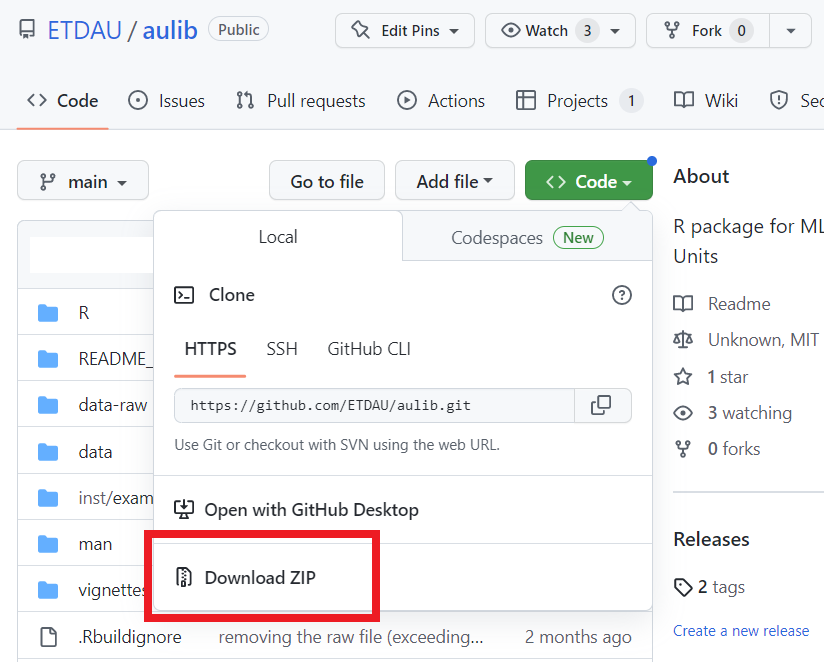

```{r setup, include=FALSE}
knitr::opts_chunk$set(echo = TRUE, comment = "")

library(tidyverse)
library(ggplot2)
library(aulib)
```


R package for MLITSD's Analytics Units.

## Installation   

Install the most updated version using `remotes::install_github()`  
```
remotes::install_github("ETDAU/aulib")
```

Or, a source package using `devtools::install_github()`    
```
devtools::install_github("https://github.com/ETDAU/aulib/releases/tag/v0.0.0.9000")
```

### Installing from local directory   

For those with access to `ETDAU` github repo, try installing from a local directory:
```{r eval = FALSE}
install.packages(
  "C:/path to aulib folder", 
  repos = NULL, 
  type = "source"
  )
```


Alternatively, follow the steps below:   
1. Download the repo
   

2. Unzip the `aulib-main.zip` file

3. Install using `devtools::install()`
Make sure to change the path

```{r eval = FALSE}
devtools::install("C:\Users\your_name\Downloads\aulib-main")
```

## Functions   

### `au_palette()`      
`au_palette()` provides a palette of accessible colours that are recommended by the [OPS](https://intra.ontario.ca/tbs/ontario-logo) (`palette = "ops"`) and are commonly used in the analytics units (`palette = "au"`).  


```{r}
# create fake data 
tibble(w = sample(LETTERS[1:6], size = 100, replace = T)) %>%
  count(w) %>% 
  # create a bar graph with the fake data  
  ggplot(aes(x = w,
             y = n,
             fill = w)) +
  geom_bar(stat = "identity",
           position = position_dodge(.8)) + 
  scale_fill_manual(guide = "none",
                    # using AU palette (Or leave the argument blank; `au_palette()`)
                    values = au_palette(palette = "au")) +
  scale_y_continuous("Count") +
  scale_x_discrete("") + 
  theme_classic()
```

You can use both `ops` and `au` palettes by leaving the argument empty: `au_palette()`.    


### `make_ca_connection()`       
`make_ca_connection()` creates a connection object using an ODBC driver with the log-in credentials saved as the system environment variables as "userid" (user ID) and "pwd" (password). For saving your credentials in your `.Renviron`, check this [instruction](https://github.com/ETDAU/aulib/blob/main/vignettes/odbc-credentials.Rmd).      

```
con = make_ca_connection()
```

### `rm_dup_response()`   
`rm_dup_response()` is a helper function for cleaning duplicated responses that are concatenated (e.g., "yes, yes"). 

```{r}
# create a vector of strings with some duplicated responses
tibble(duplicated_response = c("yes, yes", "no", "yes, no", "YES, yes",
                               "hello world, hello WORLD",
                               "hello world, bye world")) %>% 
  # apply `rm_dup_responses()` to clean the duplicated_response column  
  mutate(clean_response = rm_dup_responses(duplicated_response, 
                                           sep = ","))
```


### `binary_to_numeric()`    
`binary_to_numeric()` converts "yes" and "no" responses to numeric values of 1 and 0, respectively.  


```{r}
# create a string of binary responses
tibble(binary_response = c(sample(c("yes", "no"), 6, replace = TRUE), "YES")) %>% 
  # apply `binary_to_numeric()` to convert into numeric values 
  mutate(numeric_response = binary_to_numeric(binary_response))
```

### `cross_validate()`   
`cross_validate()` allows you to cross-validate recoding (e.g., dicotomizing, converting to numeric values) by comparing levels in the original and transformed columns side by side. 

Create a fake data set with some columns and recode these columns.   
```{r}
data =
  data.frame(x = sample(c("yes", "no", "maybe"),
                        100,
                        replace = TRUE),
             y = sample(LETTERS[1:5],
                        size = 100,
                        replace = TRUE),
             z = sample(LETTERS,
                        size = 100,
                        replace = TRUE),
             xy = sample(1:100,
                         100)) %>%
  #' transform variables 
  mutate(x_yn = # dichotomize "x"
           ifelse(x == "yes", 1,
                       ifelse(x == "no", 0, NA)),
         across(y, # convert "y" into numeric
                ~case_when(. == "A" ~ 1L,
                           . == "B" ~ 2L,
                           . == "C" ~ 3L,
                           . == "D" ~ 4L,
                           . == "E" ~ 5L,
                           TRUE ~ NA_integer_),
                .names = "{.col}_num"))

head(data)
```

To inspect whether/how the transformed levels correspond to the original levels, use `codebook = FALSE`:      
```{r}
data %>% 
  # exclude untransformed columns
  select(-c(z, xy)) %>% 
  cross_validate(data = .,
                 suffix = c("yn", "num"),
                 codebook = FALSE)

```

To create a codebook with both original and transformed variables with their corresponding levels, use `codebook = TRUE`:    
```{r}
cross_validate(data,
               suffix = c("yn", "num"),
               codebook = TRUE)

```


### `clean_query()`    
`clean_query()` is a function created by [Tori Oblad](https://stackoverflow.com/a/58446028) that facilitates importing `.sql` queries into R by removing comment lines and line breaks from queries. 


## Datasets   
`aulib` contains metadata documentation as data.   

### `geo_on_er_cd_names`   
A subset of [data from Statistics Canada](https://www12.statcan.gc.ca/census-recensement/2021/geo/aip-pia/attribute-attribs/index2021-eng.cfm?year=2021) containing economic regions and census divisions of IES catchment areas (`cduid`).   

```{r paged.print=TRUE}
geo_on_er_cd_names
```

### `ca_doc`    
Documentation containing metadata of CA data and information about Common Assessment questions. This is useful for manipulating and transforming CA data (e.g., pivoting into a wide-format).  

### `noc_2021`   

2021 NOC codes, corresponding job titles, skill levels, and TEER.   

