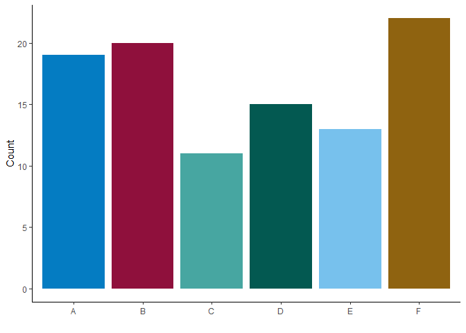

The AU’s library of R functions
================

R package for MLITSD’s Analytics Units.

## Installation

Install the most updated version using `remotes::install_github()`

    remotes::install_github("ETDAU/aulib")

Or, a source package using `devtools::install_github()`

    devtools::install_github("https://github.com/ETDAU/aulib/releases/tag/v0.0.0.9000")

## Functions

### `au_palette()`

`au_palette()` provides a palette of accessible colours that are
recommended by the [OPS](https://intra.ontario.ca/tbs/ontario-logo)
(`palette = "ops"`) and are commonly used in the analytics units
(`palette = "au"`).

``` r
# create fake data 
tibble(w = sample(LETTERS[1:6], size = 100, replace = T)) %>%
  count(w) %>% 
  # create a bar graph with the fake data  
  ggplot(aes(x = w,
             y = n,
             fill = w)) +
  geom_bar(stat = "identity",
           position = position_dodge(.8)) + 
  scale_fill_manual(guide = "none",
                    # using AU palette (Or leave the argument blank; `au_palette()`)
                    values = au_palette(palette = "au")) +
  scale_y_continuous("Count") +
  scale_x_discrete("") + 
  theme_classic()
```

<!-- -->

You can use both `ops` and `au` palettes by leaving the argument empty:
`au_palette()`.

### `make_ca_connection()`

`make_ca_connection()` creates a connection object using an ODBC driver
with the log-in credentials saved as the system environment variables as
“userid” (user ID) and “pwd” (password). For saving your credentials in
your `.Renviron`, check this
[instruction](https://github.com/ETDAU/aulib/blob/main/vignettes/odbc-credentials.Rmd).

    con = make_ca_connection()

### `rm_dup_response()`

`rm_dup_response()` is a helper function for cleaning duplicated
responses that are concatenated (e.g., “yes, yes”).

``` r
# create a vector of strings with some duplicated responses
tibble(duplicated_response = c("yes, yes", "no", "yes, no", "YES, yes",
                               "hello world, hello WORLD",
                               "hello world, bye world")) %>% 
  # apply `rm_dup_responses()` to clean the duplicated_response column  
  mutate(clean_response = rm_dup_responses(duplicated_response, 
                                           sep = ","))
```

    # A tibble: 6 × 2
      duplicated_response      clean_response        
      <chr>                    <chr>                 
    1 yes, yes                 yes                   
    2 no                       no                    
    3 yes, no                  yes, no               
    4 YES, yes                 YES                   
    5 hello world, hello WORLD hello world           
    6 hello world, bye world   hello world, bye world

### `binary_to_numeric()`

`binary_to_numeric()` converts “yes” and “no” responses to numeric
values of 1 and 0, respectively.

``` r
# create a string of binary responses
tibble(binary_response = c(sample(c("yes", "no"), 6, replace = TRUE), "YES")) %>% 
  # apply `binary_to_numeric()` to convert into numeric values 
  mutate(numeric_response = binary_to_numeric(binary_response))
```

    # A tibble: 7 × 2
      binary_response numeric_response
      <chr>                      <int>
    1 yes                            1
    2 yes                            1
    3 yes                            1
    4 no                             0
    5 no                             0
    6 no                             0
    7 YES                            1

### `cross_validate()`

`cross_validate()` allows you to cross-validate recoding (e.g.,
dicotomizing, converting to numeric values) by comparing levels in the
original and transformed columns side by side.

Create a fake data set with some columns and recode these columns.

``` r
data =
  data.frame(x = sample(c("yes", "no", "maybe"),
                        100,
                        replace = TRUE),
             y = sample(LETTERS[1:5],
                        size = 100,
                        replace = TRUE),
             z = sample(LETTERS,
                        size = 100,
                        replace = TRUE),
             xy = sample(1:100,
                         100)) %>%
  #' transform variables 
  mutate(x_yn = # dichotomize "x"
           ifelse(x == "yes", 1,
                       ifelse(x == "no", 0, NA)),
         across(y, # convert "y" into numeric
                ~case_when(. == "A" ~ 1L,
                           . == "B" ~ 2L,
                           . == "C" ~ 3L,
                           . == "D" ~ 4L,
                           . == "E" ~ 5L,
                           TRUE ~ NA_integer_),
                .names = "{.col}_num"))

head(data)
```

          x y z xy x_yn y_num
    1 maybe A R  7   NA     1
    2 maybe E Z 72   NA     5
    3   yes B Z 13    1     2
    4 maybe E V  9   NA     5
    5    no C S 52    0     3
    6 maybe D N  8   NA     4

To inspect whether/how the transformed levels correspond to the original
levels, use `codebook = FALSE`:

``` r
data %>% 
  # exclude untransformed columns
  select(-c(z, xy)) %>% 
  cross_validate(data = .,
                 suffix = c("yn", "num"),
                 codebook = FALSE)
```

    [[1]]
      x_yn     x
    1    0    no
    2    1   yes
    3   NA maybe

    [[2]]
      y_num y
    1     1 A
    2     2 B
    3     3 C
    4     4 D
    5     5 E

To create a codebook with both original and transformed variables with
their corresponding levels, use `codebook = TRUE`:

``` r
cross_validate(data,
               suffix = c("yn", "num"),
               codebook = TRUE)
```

    Warning in cross_validate(data, suffix = c("yn", "num"), codebook = TRUE):
    Column(s) with too many levels (xy) were excluded.

    # A tibble: 5 × 2
      variable response_options                                                     
      <chr>    <chr>                                                                
    1 x        maybe, no, yes                                                       
    2 x_yn     0 = no, 1 = yes, maybe                                               
    3 y        A, B, C, D, E                                                        
    4 y_num    1 = A, 2 = B, 3 = C, 4 = D, 5 = E                                    
    5 z        A, B, C, D, E, F, G, H, I, J, K, L, M, N, O, P, Q, R, S, T, U, V, W,…

### `clean_query()`

`clean_query()` is a function created by [Tori
Oblad](https://stackoverflow.com/a/58446028) that facilitates importing
`.sql` queries into R by removing comment lines and line breaks from
queries.

## Datasets

`aulib` contains metadata documentation as data.

### `geo_on_er_cd_names`

A subset of [data from Statistics
Canada](https://www12.statcan.gc.ca/census-recensement/2021/geo/aip-pia/attribute-attribs/index2021-eng.cfm?year=2021)
containing economic regions and census divisions of IES catchment areas
(`cduid`).

``` r
geo_on_er_cd_names
```

    # A tibble: 50 × 9
       est_region        est_r…¹ cdname cduid cddgu…² cdtype ernam…³ eruid…⁴ erdgu…⁵
       <chr>             <chr>   <chr>  <chr> <chr>   <chr>  <chr>   <chr>   <chr>  
     1 Ottawa            10      Storm… 3501  2021A0… UC     Ottawa  3510    2021S0…
     2 Ottawa            10      Presc… 3502  2021A0… UC     Ottawa  3510    2021S0…
     3 Ottawa            10      Ottawa 3506  2021A0… CDR    Ottawa  3510    2021S0…
     4 Ottawa            10      Leeds… 3507  2021A0… UC     Ottawa  3510    2021S0…
     5 Ottawa            10      Lanark 3509  2021A0… CTY    Ottawa  3510    2021S0…
     6 Kingston--Pembro… 4       Front… 3510  2021A0… CTY    Kingst… 3515    2021S0…
     7 Kingston--Pembro… 4       Lenno… 3511  2021A0… CTY    Kingst… 3515    2021S0…
     8 Kingston--Pembro… 4       Hasti… 3512  2021A0… CTY    Kingst… 3515    2021S0…
     9 Kingston--Pembro… 4       Princ… 3513  2021A0… CDR    Kingst… 3515    2021S0…
    10 Muskoka--Kawarth… 7       North… 3514  2021A0… CTY    Muskok… 3520    2021S0…
    # … with 40 more rows, and abbreviated variable names ¹​est_region_id,
    #   ²​cddguid_dridugd, ³​ername_renom, ⁴​eruid_reidu, ⁵​erdguid_reidugd
